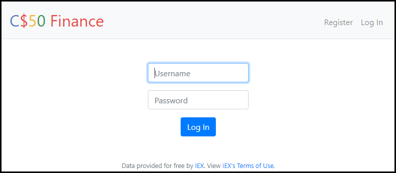
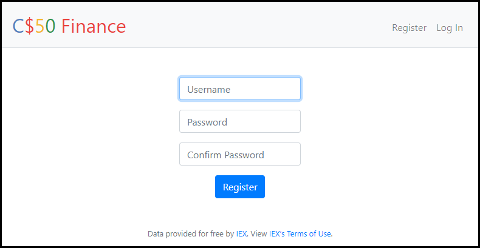

# Web-Finance

An intermediate web development project offered by HarvardX's CS50: Introduction to Computer Science course.

This full stack web project utilizes Python (including Jinja), JavaScript, SQL, HTML5, and CSS3 to create a data-based web simulation of a stock investment portfolio. The images shown below are snapshots of the features in the web application. Users are able to use the application to view current stock price (via [IEX Cloud Financial Data API](https://iexcloud.io/?gclid=CjwKCAjw5Kv7BRBSEiwAXGDElUW_WBda7mvhwjNMtXoZkzVZmtxiACpAbGi2HUYwqAGJ_wgkkt1qmhoCZ4UQAvD_BwE)), and are given $10,000 to simulate the buying and selling experience of investments.

After creating an account and buying initial stocks, users can return to their profile after some time to view the performance of their portfolio. More details following the images below.

Skills Used: API_Keys for data, Python + SQL for back end, and HTML + CSS + JavaScript for front end.

Gian Millare's Repository for CS50: Introduction to Computer Science by HarvardX -------> [Visit Repository](https://github.com/gianmillare/CS50-Introduction-to-Computer-Science)

<h2 align="center">Preview 1: Login</h2>

The greeting page of the application. Users will need to login to the website using an account. If an account for the user does not exist, they have the option to register a username and password.

<h2 align="center">Preview 2: Register</h2>

If a user does not have an account, they will click on register to enter the registration page. Entering a unique username, a password, and confirming the password will successfully register the user.

